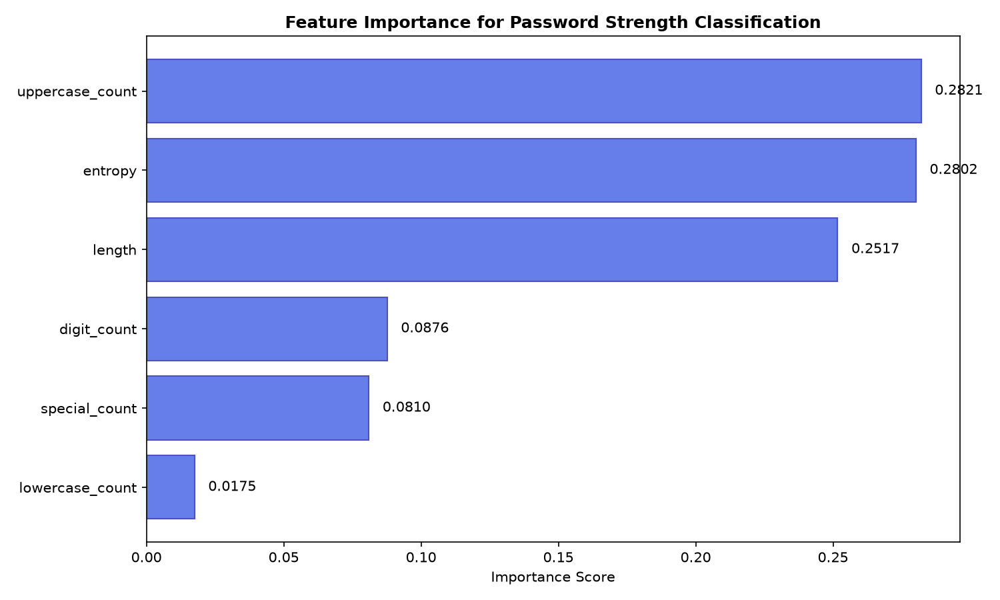
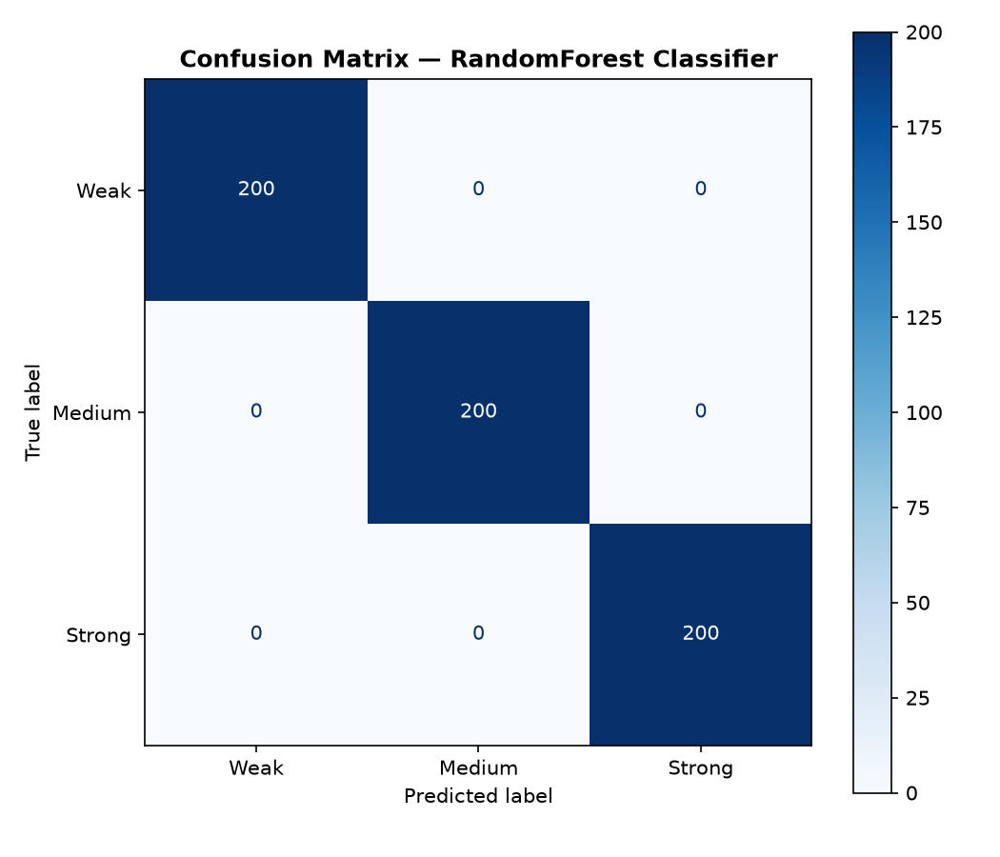

# 🔐 Password Strength Analyzer

A hybrid **rule-based + machine learning** system for real-time password strength analysis, built as a final year academic project.

---
## 🌐 Live Demo

**[Try it live →](https://password-strength-analyzer-XXXX.onrender.com)**

*(Note: The app may take 30 seconds to wake up on the free tier.)*

## ✨ Features

- **Real-time analysis** as you type
- **Rule-based scoring** using Shannon entropy and pattern detection
- **Machine learning classifier** (RandomForest, 100% test accuracy)
- **Actionable feedback** for password improvement
- **Secure hashing demo** (SHA-256 with random salt)
- **Strong password generator** (20 characters, cryptographically secure)
- **Responsive modern UI** with smooth animations
- **Privacy-first design** — passwords are never stored or transmitted

---

## 📸 Screenshots

### Live Analysis

### ML Model Performance

---

## 🏗️ System Architecture

User Input → Flask Backend
├── Rule-based Analyzer (entropy, patterns, scoring)
├── ML Classifier (RandomForest)
└── SHA-256 Hash Demo
↓
JSON Response
↓
Frontend Display (strength meter + feedback)

---

## 🧪 Sample Results

| Password | Rule Score | Rule Label | ML Prediction | ML Confidence |
|---|---|---|---|---|
| `123456` | 8/100 | Weak | Weak | 99% |
| `hello123` | 30/100 | Weak | Weak | 98% |
| `Dragon4821` | 55/100 | Medium | Medium | 94% |
| `MyPassword@2026!` | 64/100 | Medium | **Strong** | 100% |
| `Xk9#mP2$vQ8@wL3!` | 92/100 | Strong | Strong | 100% |

*Note the row with `MyPassword@2026!` — the rule-based and ML systems disagree, illustrating the value of the hybrid approach.*

---

## 📊 Machine Learning Model

| Property | Value |
|---|---|
| **Algorithm** | RandomForestClassifier |
| **Trees** | 150 |
| **Max Depth** | 15 |
| **Features** | 6 (length, lowercase, uppercase, digits, specials, entropy) |
| **Training Set** | 3,000 synthetic passwords (balanced) |
| **Test Accuracy** | 100% |
| **Top Features** | uppercase_count (0.28), entropy (0.28), length (0.25) |

---

## 🛠️ Technology Stack

- **Backend:** Python 3.12, Flask, Flask-CORS
- **ML/Data:** scikit-learn, pandas, numpy, joblib
- **Visualization:** matplotlib
- **Frontend:** HTML5, CSS3, Vanilla JavaScript
- **Security:** hashlib (SHA-256), secrets module

---

## 🚀 Setup & Installation

### Prerequisites
- Python 3.10+ installed
- Git (optional, for cloning)

### Steps

1. **Clone the repository:**
   bash
   git clone https://github.com/YOUR-USERNAME/password-strength-analyzer.git
   cd password-strength-analyzer

2. **Create virtual environment:**
python -m venv .venv 

**Activate it :**
Windows : .venv\Scripts\activate
Mac/Linux: .venv/bin/activate

3. **Install dependencies:**
pip install -r requirements.txt

4. **Train the ML model(one-time):**
python ml_trainer.py
**This generates password_model.pkl**

5. **Run the application:**
python app.py

6. **Open in your browser:**
http://127.0.0.1:5000

*** Project structure *** 

password-strength-analyzer/
├── app.py                     # Flask application entry point
├── generate_chart.py          # Report chart generator
├── requirements.txt           # Python dependencies
├── README.md                  # This file
├── LICENSE                    # MIT License
├── .gitignore
│
├── models/
│   ├── __init__.py
│   ├── ml_trainer.py          # ML training pipeline
│   ├── password_analyzer.py   # Rule-based analyzer
│   └── password_model.pkl     # Trained model (generated)
│
├── utils/
│   ├── __init__.py
│   └── validators.py          # Input validation
│
├── static/
│   ├── script.js              # Frontend logic
│   └── style.css              # Styling
│
├── templates/
│   └── index.html             # Main UI
│
└── report_charts/             # Generated figures for report
    ├── class_distribution.png
    ├── confusion_matrix.png
    ├── feature_importance.png
    └── metrics_by_class.png

  **Security Considerations:**

· Passwords are never stored or logged
· All analysis is performed in-memory
· SHA-256 hashing is demonstrated only for educational purposes
· For real authentication, use bcrypt or argon2 with proper salting
· Breach checking (optional) uses k-anonymity — only the first 5 characters of the hash are sent

**📚 References**

· NIST SP 800-63B — Digital Identity Guidelines
· Shannon, C. E. (1948). A Mathematical Theory of Communication
· scikit-learn documentation
· Flask documentation
· OWASP Password Storage Cheat Sheet

**Author**
Aayushi Suresh Padvi 
Final year Project 2026
P. G. College of Engineering and Technology, Nandurbar
Dr. Babasaheb Ambedkar Technological University, Lonere, Raigad, Maharashtra

Email - aayushipadvi9@gmail.com
Linkedln -  www.linkedin.com/in/aayushi-padvi-a407b6296

